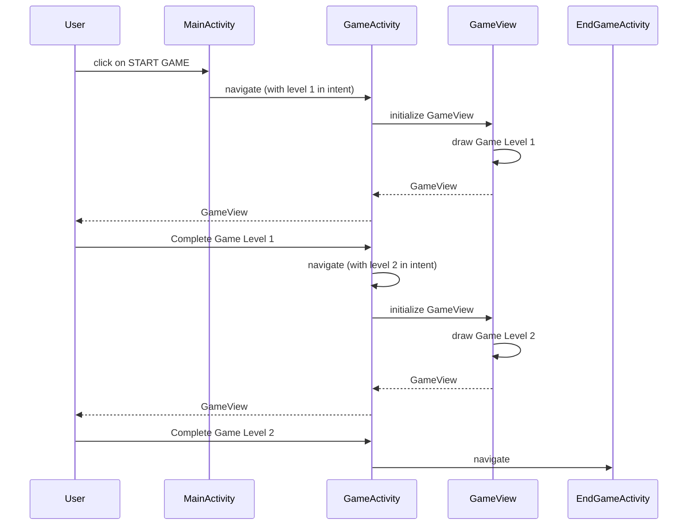

https://github.com/user-attachments/assets/67b527e7-eba4-4044-8f56-0f22d0f5f90c
# Background

In the year 2100, Earth has undergone significant changes due to rapid technological advancements and environmental challenges. The planet's once-thriving ecosystems have been devastated by climate change and pollution, leading to the rise of sprawling megacities and vast wastelands.

Amidst the chaos, a young engineer named Steve emerges as an unlikely hero. Born and raised in the heart of one such megacity, Steve possesses an unmatched talent for robotics and problem-solving. With a deep-rooted passion for preserving the environment, he dreams of restoring balance to the world and reclaiming nature's lost beauty.

Steve's journey begins when he stumbles upon a long-forgotten underground facility buried beneath the city's skyscrapers. Within the depths of the facility lies an ancient relic known as the "Core of Harmony," a powerful artifact rumored to hold the key to restoring Earth's ecological balance.

However, accessing the Core proves to be no easy task. The facility is filled with intricate puzzles and obstacles designed to protect the Core from intruders. To reach it, Steve must utilize his engineering skills to manipulate crates and navigate through the facility's labyrinthine corridors.

As Steve progresses deeper into the facility, he uncovers the truth behind its origins. It was once a research center dedicated to sustainable technology and renewable energy, abandoned long ago amidst the chaos of societal collapse. Now, it stands as a testament to humanity's past mistakes and a beacon of hope for a brighter future.

But Steve is not alone in his quest. Corporate conglomerates and rogue factions seek to exploit the Core's power for their own gain, threatening to plunge the world into further turmoil. With time running out, Steve must push forward, outsmarting his adversaries and unlocking the secrets hidden within the facility's walls.

With every crate pushed and every puzzle solved, Steve draws closer to the Core of Harmony. Will he succeed in harnessing its power to heal the world, or will Earth's fate be sealed by greed and corruption?

The destiny of humanity hangs in the balance as Steve, the eco-engineer extraordinaire, embarks on his odyssey to save the planet.

# Requirements
## Required Features

- [x] Contains at least 1 activity drawn using 2D graphics
- Works in real time
    - [x] Real time elements updated synchronously in each frame(Timer arc)
    - [x] Interval elements updated synchronously (Timer) at predetermined interval steps
    - [x] Asynchronous elements updated in threads (Swipe Executor Service)
- [x] Interactive, responds to user events (On Touch Listener)
- [x] Perform parallel operations by creating at least one worker thread (Game Thread)
- [x] Ensures that threads synchronize updates to a common state with built-in synchronization primitives (use mutexes)

## Additional Features

- At least 1 activity containing Standard GUI Components 
  - [x] MainActivity
  - [x] AuthorsActivity
  - [x] RecordsActivity
  - [x] EndGameActivity
- [x] Store User Record in SQLite
- [x] Notifications on Win
- [x] Vibrations on out of bounds
- [x] Screen always on (in GameView)
- [x] Using intent to pass data (pass level number to GameActivity)

# Code Structure

The code is primarily arranged by activities
  - author
  - game
  - records (named to records because `record` is a keyword in java)

The other packages are auxiliary
  - db: Handles database logic
  - utils: Classes not directly related to the Activity / can be used globally

# Features

- Navigation Menu (Main Activity)
  - Uses intent to pass data (Level number)
- Show Authors
  - Standard UI Activity
  - Uses `RecyclerView` to display the records fetched from SQLite
- Create and Retrieve Records from database
  - Preserve a user's winning state when it's terminated
- A timer for user to keep track of the time
  - Interval elements updated synchronously at predetermined interval steps (Second hand)
  - Real time elements updated synchronously in each frame (progressing arc)
- Game: Pushing crates
  - Interactive, responds to user events (On Touch Listener)
  - Perform parallel operations by creating at least one worker thread (Game Thread)
  - Ensures that threads synchronize updates to a common state with built-in synchronization primitives (use mutexes)
  - Integrate mobile features: Vibrations and notifications
    - Vibrations upon winning, going out of bounds, or illegal steps
    - Notifications upon timeout, winning
  - Screen Always On
  - Non-trivial navigation of the back stack via deliberate control of intents that manage activities 
    - Activity stops when user is timed out

# Features Design

## 2D Graphics and UI Elements

### UI Elements (Highlights)

`MainActivity` consist of `Button`s. The buttons are used for navigation.

`RecordsActvity` consists of `TextView`s and `RecyclerView`. 

RecyclerView is not as straight forward as other common UI components. Setting up RecyclerView requires 
defining your own adapter to display the data, as well as the layout (see `res/layout/record_list_item.xml`).

### 2D Graphics

The `GameActivity` class has a `GameView` that renders the `Game` dynamically.

The `GameView` handles the rendering logic and the `Game` contains the game logic.

`Game` renders two components:

1. Board 
   - Board is drawn by the `Game` class, it keeps track of the player, flag and the crate's position.
   - Each time a player tries to move, there are checks put in place to see if the player's movement is valid
   - If the player's movement is valid, the player will be able to move, otherwise, the device will 
     vibrate to inform the player that they made a wrong move
   
2. Clock
   - Clock is taken from the lab3 and I believe PJ has done a good job explaining it. 
     Hence I will not reiterate what PJ has taught.

### Real time, Interactive, Thread and Synchronization

The `Game` works in real time because the surface will be updated each frame.

It accepts user inputs including swiping left, right, up, down etc. which makes it interactive.

Each swiping input is submitted to a `SwipeExecutorService` which makes it asynchronous.

## Screen Always On

When a `GameView` is initialized, it will set the screen to always on.

## Feedbacks

There are two types of feedback mechanism to notify a user:

1. Notification
2. Vibration

When a user wins, timeout, or get stuck in the game, a notification will show up informing user the status of the game.

When a user tries to go out of bounds, for example, moving to the right when he's already at the boundary, the device will vibrate to tell him that this is an illegal operation.

## Records in SQLite

When user wins the game, a record will be stored in the database containing the id and the time taken by the user to complete the game. Users can see their records in the `RecordActivity`.

# Sequence Diagrams

(Drawn in Mermaid)

## Navigation

## Functions

